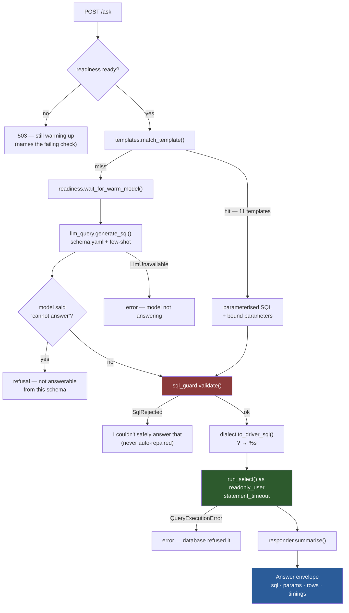
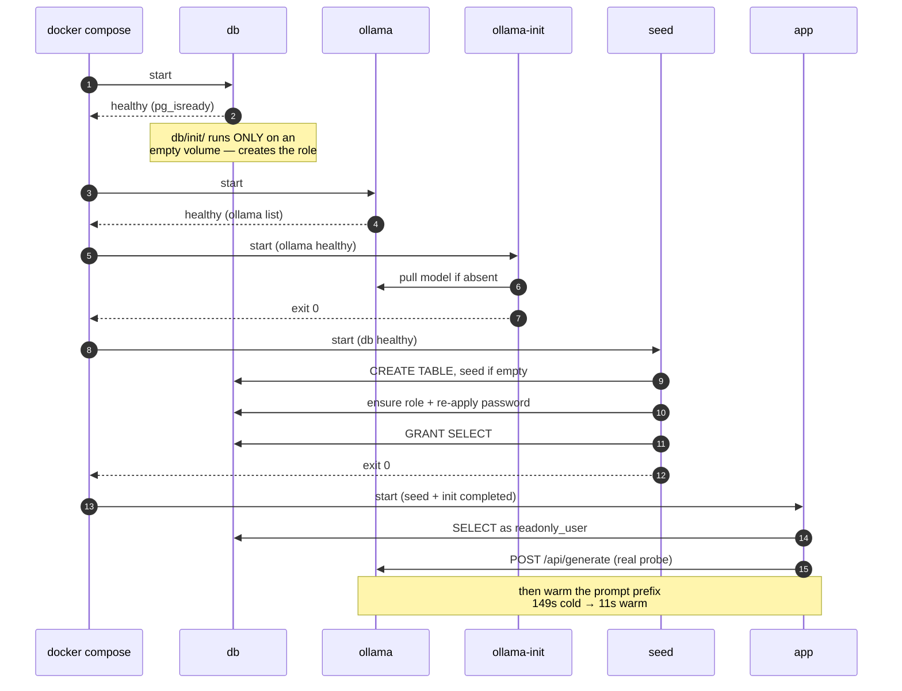

# Code flow

## What this is

A chatbot that answers questions like *"how many good vs bad parts did Line A
make last week?"* in plain English — with the SQL it ran always on show.

The database is the point. A Python data extractor already parses machine logs
from a three-line production plant into a database that Power BI reads. This
adds a conversational layer over that same data without changing anything
underneath it.

One constraint shapes everything else: **the target IT environment forbids
external AI calls.** The model is an open-weight one (`qwen2.5-coder:7b`) served
by Ollama in a container on the same host. Once it has been pulled, the whole
stack runs with the network disabled.

That constraint is visible in every diagram below:

- **A 7B model on CPU is slow** — 10 to 30 seconds a question. So the common
  questions never reach it: eleven hand-written templates answer them in ~15 ms
  with exact, reproducible SQL. The model is the fallback, not the front door.
- **A 7B model is also fallible**, so nothing it writes is trusted. Every
  statement, from either path, is validated with sqlglot and then executed by a
  database role that holds `SELECT` and nothing else.
- **Confidently wrong is the failure worth engineering against.** A template
  that cannot answer the exact question asked declines rather than answering a
  near-miss, and a rejected query is reported rather than repaired.

The POC runs on PostgreSQL; the client's production database is SQL Server.
Every vendor-specific concern sits behind a single module — which is what the
last diagram is about.

## A question, end to end

The guard sits on the join of both routes, not on one branch — there is no path
to the database that skips it.

## Bring-up ordering

## Layering

```mermaid
flowchart LR
    subgraph web["HTTP"]
        M["main.py"]
    end
    subgraph brain["Question handling"]
        P["pipeline.py"]
        TP["templates.py"]
        EN["entities.py"]
        LQ["llm_query.py"]
        RS["responder.py"]
    end
    subgraph safety["Safety"]
        SG["sql_guard.py"]
        SM["semantic.py<br/>schema.yaml"]
    end
    subgraph data["Vendor boundary"]
        DI["db/dialect.py"]
        CN["db/connection.py"]
    end

    M --> P
    P --> TP --> EN
    P --> LQ --> SM
    P --> SG --> SM
    P --> RS
    P --> CN --> DI
    TP --> DI
    SG --> DI

    style safety fill:#3a2b2b
    style data fill:#2b3340
```

Only `db/` imports a driver or writes vendor SQL — that is what makes the
SQL Server migration a one-module change.

---

*Diagrams are [Mermaid](https://mermaid.js.org/) — GitHub renders them natively,
so they need no tooling to read, and they diff line-by-line when the code they
describe changes.*
